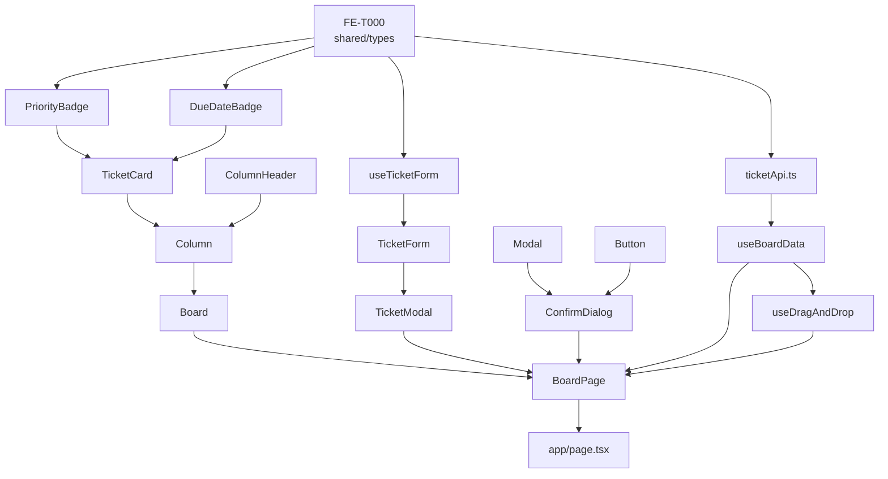

# Tika - 프론트엔드 구현 계획 (FRONTEND_TASKS.md)

> 참고 문서: [COMPONENT_SPEC.md](./COMPONENT_SPEC.md), [REQUIREMENTS.md](./REQUIREMENTS.md), [TEST_CASES.md](./TEST_CASES.md), [API_SPEC.md](./API_SPEC.md)
> 대상 디렉터리: `src/client/`, `app/page.tsx`
> 순서 원칙: **의존성이 없는 말단(리프) 컴포넌트부터 시작해, 그 위에 조합되는 컴포넌트 → 컨테이너 → 페이지 순으로 버텀업 구현**. 같은 Phase 안의 항목은 서로 의존하지 않으므로 병렬 진행 가능([P] 표시).
> TDD: CLAUDE.md의 Red(테스트만 작성, 실패 확인) → Green(테스트 통과 최소 구현) → Refactor(테스트 유지하며 정리) 사이클을 각 항목에 그대로 적용한다. Red 단계의 테스트 케이스는 가능한 한 `TEST_CASES.md`에 이미 정의된 `TC-COMP-*`/`TC-INT-*` ID를 그대로 사용한다.

---

## 0. 선행 조건: 공유 타입 정비 (Phase 0, 블로킹)

컴포넌트 작업을 시작하기 전에 먼저 처리해야 한다. 현재 `src/shared/types/index.ts`가 `Ticket`, `TicketStatus` 타입을 **정의 없이 참조만** 하고 있어 `npx tsc --noEmit` 시 타입 에러(`TS2304: Cannot find name 'Ticket'`)가 난다. 이 파일은 `TicketCard`, `PriorityBadge`, `BoardColumn`, `ticketApi.ts` 등 프론트엔드 전체가 import하는 기반 타입이므로, 이게 고쳐지지 않으면 이후 어떤 컴포넌트도 타입체크를 통과할 수 없다.

| ID | 파일 | 작업 | 의존성 |
|---|---|---|---|
| FE-T000 [x] | `src/shared/types/index.ts` | `Ticket`(DB 티켓 전체 필드), `TicketStatus`, `TicketPriority` 타입 정의 추가. `CreateTicketInput`/`UpdateTicketInput`은 새로 만들지 말고 `src/shared/validations/ticket.ts`의 `z.infer` 타입을 재노출(`export type { CreateTicketInput, UpdateTicketInput }`) | 없음 |

**검증**: 런타임 테스트 대상이 아닌 순수 타입 작업이므로 Red/Green 사이클 대신 `npx tsc --noEmit`으로 에러 0건 확인. 이후 모든 Phase의 "Green" 단계 검증에 이 명령이 공통으로 포함된다. **완료** (2026-09-25).

---

## 1. 의존성 그래프

읽는 법: 화살표는 "이게 있어야 저걸 만들 수 있다"는 뜻이다. `PriorityBadge`와 `OverdueBadge`는 서로 의존하지 않으므로 동시에 만들어도 되고, `ticketApi.ts`/`useTicketForm` 트랙과 `PriorityBadge`/`OverdueBadge`/`ConfirmDialog` 트랙도 서로 독립이라 병렬 가능하다. 모든 화살표가 `BoardPage`로 모이는 것이 이 컴포넌트 트리의 특징이다(COMPONENT_SPEC.md 1장과 동일 구조, 화살표만 반대 방향).

---

## 2. Phase별 작업 목록

### Phase 1 — 말단 순수 컴포넌트 [P] (서로 독립, 병렬 가능)

다른 client 컴포넌트에 의존하지 않는 것들. `FE-T000` 완료 후 시작 가능. `Button`, `Modal`은 원래 이 문서에 없던 항목이었으나 실제 구현 중 필요해져 Phase 1에 추가됨(둘 다 하위 의존성 없음).

#### FE-T100 [x] [P] Button
- **파일**: `src/client/components/Button.tsx`, 테스트: `__tests__/components/Button.test.tsx`
- **Props**: `variant`('primary'|'secondary'|'danger'|'ghost', 기본 primary), `size`('sm'|'md'|'lg', 기본 md), `isLoading`, `onClick`, `children`
- **완료** (2026-09-25) — 12개 테스트 전부 통과. `ConfirmDialog`가 이 컴포넌트를 재사용.

#### FE-T101 [x] [P] PriorityBadge
- **파일**: `src/client/components/PriorityBadge.tsx`, 테스트: `__tests__/components/PriorityBadge.test.tsx`
- **Props**: `{ priority: TicketPriority }`
- **의존성**: `FE-T000`(타입)만
- **완료** (2026-09-25) — `TC-COMP-007-01~03`(LOW/MEDIUM/HIGH 색상 클래스) 3개 테스트 전부 통과. 라벨은 "낮음"/"보통"/"높음"으로 표시.

#### FE-T102 [x] [P] DueDateBadge (구 OverdueBadge)
- **파일**: `src/client/components/DueDateBadge.tsx`, 테스트: `__tests__/components/DueDateBadge.test.tsx`
- **Props**: `{ dueDate: string; isOverdue?: boolean }`
- **의존성**: 없음
- **변경 사항**: 당초 계획한 "isOverdue일 때만 조건부 렌더되는 경고 전용 뱃지(OverdueBadge)" 대신, 종료예정일 자체를 항상 표시하고 `isOverdue` 여부에 따라 색상만 바뀌는 `DueDateBadge`로 구현(와이어프레임의 "완료표기일" 뱃지가 모든 카드에 상시 노출되는 것과 일치). `TicketCard`에서 `isOverdue` 값을 그대로 넘겨주면 됨 — 표시 여부 자체를 부모가 조건부로 감싸는 대신 색상만 위임.
- **완료** (2026-09-25) — 3개 테스트(값 표시, overdue 경고색, 기본 중립색) 전부 통과.

#### FE-T103 [x] [P] ConfirmDialog
- **파일**: `src/client/components/ConfirmDialog.tsx`, 테스트: `__tests__/components/ConfirmDialog.test.tsx`
- **Props**: `ConfirmDialogProps` (COMPONENT_SPEC.md 5.3)
- **의존성**: `FE-T104`(Modal), `FE-T100`(Button) — 범용 `Modal` 위에 합성하는 구조로 구현(포커스 트랩/ESC/오버레이 클릭 로직을 중복 작성하지 않기 위해)
- **완료** (2026-09-25) — 5개 테스트(미렌더, title/message 표시, 확인→onConfirm, 취소→onCancel, ESC→onCancel) 전부 통과.

#### FE-T104 [x] [P] Modal (신규 — 원래 계획에 없던 범용 다이얼로그 프리미티브)
- **파일**: `src/client/components/Modal.tsx`, 테스트: `__tests__/components/Modal.test.tsx`
- **Props**: `{ isOpen, onClose, children }`
- **의존성**: 없음
- **배경**: `ConfirmDialog`와 이후 `TicketModal`이 동일한 `role="dialog"`/`aria-modal`/ESC 닫기/오버레이 클릭 닫기 규칙을 공유하므로(COMPONENT_SPEC.md 5.1, 5.3), 이 규칙을 담은 범용 `Modal`을 먼저 만들고 `ConfirmDialog`가 그 위에 조합하는 구조로 변경. `FE-T502 TicketModal`도 이 위에서 만들 예정(Phase 5에서 반영).
- **완료** (2026-09-25) — 5개 테스트(isOpen 여부, ESC 닫기, 오버레이 클릭 닫기, 컨텐츠 클릭 무시, role=dialog) 전부 통과.

---

### Phase 2 — 인프라 트랙: API 클라이언트 + 폼 훅 [P] (Phase 1과 병렬 가능, Phase 2 내부도 useTicketForm은 독립)

#### FE-T201 [x] [P] ticketApi.ts
- **파일**: `src/client/api/ticketApi.ts`, 테스트: `__tests__/client/api/ticketApi.test.ts`
- **의존성**: `FE-T000`(타입)
- **역할**: `API_SPEC.md`의 7개 엔드포인트를 얇게 감싼 `fetch` 래퍼 함수 7개 (`getBoard`, `getTicket`, `createTicket`, `updateTicket`, `completeTicket`, `deleteTicket`, `reorderTicket`). 컴포넌트/훅은 이 모듈을 통해서만 API 호출(CLAUDE.md 컨벤션).
- **완료** (2026-09-25) — 9개 테스트(7개 함수의 method/URL/body 검증, 에러 응답 시 `error` 객체 그대로 throw, 공통 Content-Type 헤더) 전부 통과. 공통 `request<T>()` 헬퍼로 처음부터 중복 없이 구현돼 별도 Refactor 불필요. 부수적으로 `src/shared/types/index.ts`에 누락돼 있던 `ReorderTicketInput` 재노출 추가.
- 테스트 위치는 기존 `__tests__/api/`(서버 라우트, 실DB 연동)와 구분하기 위해 `__tests__/client/api/`로 새로 분리(`src/client/` 미러링).

#### FE-T202 [x] [P] useTicketForm
- **파일**: `src/client/hooks/useTicketForm.ts`, 테스트: `__tests__/client/hooks/useTicketForm.test.ts`
- **의존성**: `src/shared/validations`의 `createTicketSchema`/`updateTicketSchema` (이미 구현됨)
- **완료** (2026-09-25) — 6개 테스트(초기값 설정, `handleChange` 갱신, `TC-COMP-004-06` 제목 공백 차단, `TC-COMP-004-04` 과거 종료예정일 차단, 유효 제출 시 `onSubmit` 호출+`errors` 초기화, 제출 중 `isSubmitting` true→false 전이) 전부 통과.

> `useBoardData`, `useDragAndDrop`은 Phase 2가 아니라 **Phase 5**에 배치했다 — `useBoardData`는 `ticketApi.ts`(FE-T201) 완료가 선행 조건이고, `useDragAndDrop`은 `useBoardData.moveTicket`의 시그니처가 먼저 확정돼야 하기 때문이다. 일정상 Phase 2 트랙과 동시에 시작하고 싶다면 `useBoardData`부터가 아니라 `ticketApi.ts` 목업(스텁)으로 시작해도 되지만, 아래 표에서는 실제 의존성 순서를 그대로 반영했다.

---

### Phase 3 — 티켓 카드 조합 컴포넌트

Phase 1의 `PriorityBadge`, `DueDateBadge` 완료 후 시작.

#### FE-T301 [x] TicketCard
- **파일**: `src/client/components/TicketCard.tsx`, 테스트: `__tests__/components/TicketCard.test.tsx`
- **의존성**: `FE-T101`(PriorityBadge), `FE-T102`(DueDateBadge)
- **변경 사항**: `PriorityBadge`/`DueDateBadge`의 실제 구현이 `src/client/components/Badge.tsx`로 통합됨(기존 `PriorityBadge.tsx`/`DueDateBadge.tsx`는 `Badge.tsx`를 재노출하는 얇은 파일로 유지 — 기존 테스트 파일들의 import 경로를 건드리지 않기 위함). 오버듀 스타일은 색상 클래스 대신 카드 루트의 `data-overdue` 속성 + `globals.css`의 `.ticket-card[data-overdue="true"]` 선택자로 제어. 완료 상태는 `.ticket-card--done` 클래스.
- **완료** (2026-09-25) — 자체 정의한 C001-1~7(TEST_CASES.md TC-COMP-001을 구체화) 7개 테스트 전부 통과: 기본 렌더링, `data-overdue` 속성, `ticket-card--done` 클래스, `dueDate=null` 시 날짜 영역 숨김, 클릭 시 `onClick(ticket)` 호출, 제목 `truncate` 클래스, `PriorityBadge`의 `data-priority` 속성.
  - [x] Red → Green → Refactor(리팩토링 불필요할 만큼 최소 구현) 완료
  - (드래그 가능 요소 등록은 `@dnd-kit`의 `useSortable`을 쓰지만, 테스트에서는 mock 처리. 실제 드래그 동작 검증은 Phase 6의 `TC-INT-001`에서 통합 테스트로 수행)

---

### Phase 4 — 컬럼/사이드바 컨테이너 [P] (서로 독립, 병렬 가능)

Phase 3의 `TicketCard` 완료 후 시작.

**변경 사항 (2026-09-25)**: 원래 계획한 `BoardColumn`(TODO/IN_PROGRESS/DONE 전용) + `BacklogSidebar`(BACKLOG 전용, 별도 컴포넌트) 2분할 대신, `status: TicketStatus`(BACKLOG 포함 4개 전부)를 받는 범용 `Column` 하나로 통합하고, 헤더 표시 부분을 `ColumnHeader`로 더 쪼갠 뒤, 이 둘을 조합해 "Backlog 사이드바 + 3컬럼 메인 레이아웃"을 구성하는 `Board`(레이아웃 전용, 데이터 페칭 없음 — `FE-T601 BoardPage`가 나중에 이 위에서 `useBoardData` 연동)까지 함께 만드는 구조로 진행함. `BacklogSidebar`의 "+ 새 티켓" 버튼(`onAddClick`)은 아직 미구현 — `Board`/`BoardPage` 완성 단계에서 추가 예정.

#### FE-T401a [x] ColumnHeader (신규 분리)
- **파일**: `src/client/components/ColumnHeader.tsx`, 테스트: `__tests__/components/ColumnHeader.test.tsx`
- **Props**: `{ title: string; count: number }`
- **완료** (2026-09-25) — 4개 테스트(title 표시, count 표시, count=0 표시, heading 역할) 전부 통과.

#### FE-T401 [x] Column (구 BoardColumn — BACKLOG 포함 4개 status 전부 지원하도록 범위 확장)
- **파일**: `src/client/components/Column.tsx`, 테스트: `__tests__/components/Column.test.tsx`
- **Props**: `{ status: TicketStatus; title: string; tickets: TicketWithMeta[]; onCardClick: (ticket) => void }`
- **의존성**: `FE-T301`(TicketCard), `FE-T401a`(ColumnHeader)
- **완료** (2026-09-25) — 8개 테스트(헤더 표시, position 순서 렌더, 빈 컬럼 카드 수 "0", 빈 컬럼 안내 문구 표시/미표시, TicketCard 개수 일치, 클릭 전파, `useDroppable({id: status})` 등록) 전부 통과. `SortableContext`(내부 재정렬용)로 감싸는 구조.

#### FE-T402 [x] Board (신규 — BacklogSidebar를 흡수한 레이아웃 컴포넌트)
- **파일**: `src/client/components/Board.tsx`, 테스트: `__tests__/components/Board.test.tsx`
- **Props**: `{ board: BoardData['board']; onCardClick: (ticket) => void }`
- **의존성**: `FE-T401`(Column)
- **완료** (2026-09-25) — 4개 테스트(Backlog 사이드바 렌더, TODO/In Progress/Done 3컬럼 렌더, status별 티켓 격리, 클릭 전파) 전부 통과. `Column`을 4번(BACKLOG 1 + TODO/IN_PROGRESS/DONE 3) 재사용.

---

### Phase 5 — 폼/모달 + 데이터 훅

`TicketForm`/`TicketModal`은 `useTicketForm`(Phase 2)에 의존, `useBoardData`/`useDragAndDrop`은 `ticketApi.ts`(Phase 2)에 의존. 이 Phase 안에서는 두 트랙이 서로 독립이라 병렬 가능.

#### FE-T501 [P] TicketForm
- **파일**: `src/client/components/TicketForm.tsx`
- **의존성**: `FE-T202`(useTicketForm)
- **TDD 체크리스트**:
  - [ ] Red: `TC-COMP-004-01`(빈 폼+"생성" 버튼), `TC-COMP-004-02`(제목만 입력 후 제출), `TC-COMP-004-03`(우선순위 기본값 처리 방식 확정), `TC-COMP-004-04`(과거 종료예정일 차단+에러메시지), `TC-COMP-004-06`(제목 공백 차단+에러메시지)
  - [ ] Green: 5개 테스트 통과 최소 구현 (필드: title/description/priority/plannedStartDate/dueDate)
  - [ ] Refactor: 에러 메시지 표시 위치를 필드 하단으로 일관되게 정리

#### FE-T502 [P] TicketModal
- **파일**: `src/client/components/TicketModal.tsx`
- **의존성**: `FE-T501`(TicketForm)
- **TDD 체크리스트**:
  - [ ] Red: `TC-COMP-004-05`(제출 성공 시 `onClose` 1회), `TC-COMP-005-01`(edit 모드 진입 시 기존 값으로 폼 채움), `TC-COMP-005-02`(필드 수정 후 `onSubmit`에 변경분 포함), `TC-COMP-006-01`(edit 모드에서 "삭제" 버튼 클릭 → `onDelete` 1회, `ConfirmDialog`를 직접 열지 않음에 주의)
  - [ ] Green: `mode`에 따른 조건부 렌더(빈 폼 vs `ticket` 초기값, 삭제 버튼 노출 여부) 최소 구현, `role="dialog"`/`aria-modal`/`Esc` 닫기 포함
  - [ ] Refactor: 포커스 이동(열릴 때 제목 필드, 닫힐 때 트리거로 복귀) 정리

#### FE-T503 [P] useBoardData
- **파일**: `src/client/hooks/useBoardData.ts`
- **의존성**: `FE-T201`(ticketApi.ts)
- **TDD 체크리스트**:
  - [ ] Red: 전용 TC ID 없음(TEST_CASES.md는 `BoardPage` 통합 테스트로 간접 검증) — `ticketApi`를 `jest.mock`하여 아래를 신규 테스트로 작성(제안 `TC-COMP-009-0N`): 초기 로드 시 `GET /api/tickets` 결과로 `board` 세팅, `moveTicket` 호출 즉시 낙관적 업데이트, API 실패 시 직전 스냅샷으로 롤백 + `error` 설정
  - [ ] Green: `UseBoardDataResult` 인터페이스(COMPONENT_SPEC.md 6.1) 그대로 최소 구현
  - [ ] Refactor: `moveTicket`의 `targetStatus === 'DONE'` 분기(→ `completeTicket` API) vs 나머지(→ `reorderTicket` API) 로직을 명확히 분리

#### FE-T504 useDragAndDrop
- **파일**: `src/client/hooks/useDragAndDrop.ts`
- **의존성**: `FE-T503`(useBoardData — `moveTicket` 시그니처 필요)
- **TDD 체크리스트**:
  - [ ] Red: 전용 TC ID 없음(`TC-INT-001`로 간접 검증) — `onDragEnd`가 드롭 대상 status/position을 계산해 `moveTicket`을 올바른 인자로 호출하는지 단위 테스트 신규 작성(제안 `TC-COMP-010-0N`)
  - [ ] Green: `PointerSensor`/`TouchSensor`/`KeyboardSensor` 등록 + `onDragEnd` 최소 구현
  - [ ] Refactor: position 추정 로직을 순수 함수로 분리해 테스트 용이성 확보

---

### Phase 6 — 최상위 오케스트레이션

Phase 4, Phase 5 전부 완료 후 시작. 이 프로젝트에서 유일하게 통합 테스트(`TC-INT-*`) 대상.

#### FE-T601 BoardPage
- **파일**: `src/client/components/BoardPage.tsx`
- **의존성**: `FE-T402`(Board), `FE-T502`(TicketModal), `FE-T103`(ConfirmDialog), `FE-T503`(useBoardData), `FE-T504`(useDragAndDrop)
- **TDD 체크리스트**:
  - [ ] Red: `TC-INT-001`(드래그앤드롭 → 완료 처리, US-005/US-006), `TC-INT-002`(완료 처리 → 삭제, US-006/US-008), `TC-COMP-005-03`(수정 성공 후 보드에 반영)
  - [ ] Green: 3개 테스트 통과 최소 구현 — `activeModal`/`confirmDeleteId` 로컬 상태, 하위 컴포넌트에 핸들러 배선
  - [ ] Refactor: 반응형 레이아웃(NFR-002, COMPONENT_SPEC.md 7장 — 모바일 스크롤스냅/태블릿 2칼럼/데스크톱 `sidebar+3컬럼`)을 Tailwind 클래스로 정리, `globals.css`의 `--sidebar-width`/`--column-min-width` 토큰 사용

#### FE-T602 app/page.tsx
- **파일**: `app/page.tsx`
- **의존성**: `FE-T601`(BoardPage)
- **TDD 체크리스트**:
  - [ ] Red/Green 생략 가능 — Server Component가 Client Component(`BoardPage`)를 렌더만 하는 1줄짜리 진입점이라 별도 테스트 케이스가 TEST_CASES.md에도 없음
  - [ ] 대신 `npm run dev` 기동 후 브라우저에서 보드가 실제로 로드되는지 수동 확인 (요청하신 대로 다음 컴포넌트 작업이 끝난 뒤 `/run`으로 확인 권장)

---

## 3. 전체 순서 요약 (체크박스)

- [x] FE-T000 `src/shared/types/index.ts` 타입 보강 (블로킹, 최우선)
- [x] FE-T100 [P] Button
- [x] FE-T101 [P] PriorityBadge
- [x] FE-T102 [P] DueDateBadge (구 OverdueBadge)
- [x] FE-T104 [P] Modal (신규 추가)
- [x] FE-T103 [P] ConfirmDialog (FE-T104, FE-T100 이후)
- [x] FE-T201 [P] ticketApi.ts
- [x] FE-T202 [P] useTicketForm
- [x] FE-T301 TicketCard (FE-T101, FE-T102 이후)
- [x] FE-T401a ColumnHeader (신규 분리)
- [x] FE-T401 Column (구 BoardColumn, BACKLOG 포함으로 범위 확장, FE-T301/FE-T401a 이후)
- [x] FE-T402 Board (신규, BacklogSidebar 흡수, FE-T401 이후)
- [ ] FE-T501 [P] TicketForm (FE-T202 이후)
- [ ] FE-T502 [P] TicketModal (FE-T501 이후)
- [ ] FE-T503 [P] useBoardData (FE-T201 이후)
- [ ] FE-T504 useDragAndDrop (FE-T503 이후)
- [ ] FE-T601 BoardPage (FE-T401, FE-T402, FE-T502, FE-T103, FE-T503, FE-T504 전부 이후)
- [ ] FE-T602 app/page.tsx (FE-T601 이후)

## 4. 참고: TEST_CASES.md에 없는 신규 제안 ID

아래는 TEST_CASES.md에 아직 없어서 이 문서에서 임시로 붙인 ID다. 실제 구현 시작 전에 `TEST_CASES.md`에 정식으로 추가하는 것을 권장한다(CLAUDE.md "명세 없이 구현 시작 금지" 원칙):

| 제안 ID | 대상 | 사유 |
|---|---|---|
| TC-COMP-007 | PriorityBadge | 색상 매핑 전용 테스트가 TEST_CASES.md에 없음 (TicketCard 테스트에 간접 포함만 됨) |
| TC-COMP-008 | ticketApi.ts | API 클라이언트 레이어 자체를 검증하는 TC가 없음 (useBoardData를 통한 간접 검증만 전제) |
| TC-COMP-009 | useBoardData | 낙관적 업데이트/롤백 로직 단위 테스트 TC가 없음 (TC-INT-*로 간접 검증만 전제) |
| TC-COMP-010 | useDragAndDrop | position 추정 로직 단위 테스트 TC가 없음 (TC-INT-001로 간접 검증만 전제) |
