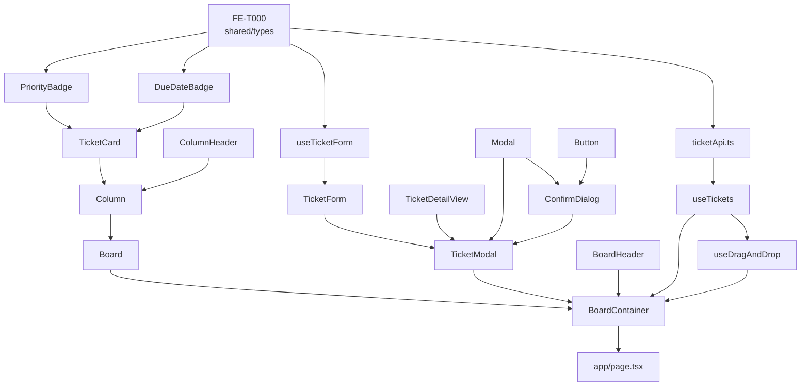

# Tika - 프론트엔드 구현 계획 (FRONTEND_TASKS.md)

> 참고 문서: [COMPONENT_SPEC.md](./COMPONENT_SPEC.md), [REQUIREMENTS.md](./REQUIREMENTS.md), [TEST_CASES.md](./TEST_CASES.md), [API_SPEC.md](./API_SPEC.md)
> 대상 디렉터리: `src/client/`, `app/page.tsx`
> 순서 원칙: **의존성이 없는 말단(리프) 컴포넌트부터 시작해, 그 위에 조합되는 컴포넌트 → 컨테이너 → 페이지 순으로 버텀업 구현**. 같은 Phase 안의 항목은 서로 의존하지 않으므로 병렬 진행 가능([P] 표시).
> TDD: CLAUDE.md의 Red(테스트만 작성, 실패 확인) → Green(테스트 통과 최소 구현) → Refactor(테스트 유지하며 정리) 사이클을 각 항목에 그대로 적용한다. Red 단계의 테스트 케이스는 가능한 한 `TEST_CASES.md`에 이미 정의된 `TC-COMP-*`/`TC-INT-*` ID를 그대로 사용한다.

---

## 0. 선행 조건: 공유 타입 정비 (Phase 0, 블로킹)

컴포넌트 작업을 시작하기 전에 먼저 처리해야 한다. 현재 `src/shared/types/index.ts`가 `Ticket`, `TicketStatus` 타입을 **정의 없이 참조만** 하고 있어 `npx tsc --noEmit` 시 타입 에러(`TS2304: Cannot find name 'Ticket'`)가 난다. 이 파일은 `TicketCard`, `PriorityBadge`, `BoardColumn`, `ticketApi.ts` 등 프론트엔드 전체가 import하는 기반 타입이므로, 이게 고쳐지지 않으면 이후 어떤 컴포넌트도 타입체크를 통과할 수 없다.

| ID | 파일 | 작업 | 의존성 |
|---|---|---|---|
| FE-T000 [x] | `src/shared/types/index.ts` | `Ticket`(DB 티켓 전체 필드), `TicketStatus`, `TicketPriority` 타입 정의 추가. `CreateTicketInput`/`UpdateTicketInput`은 새로 만들지 말고 `src/shared/validations/ticket.ts`의 `z.infer` 타입을 재노출(`export type { CreateTicketInput, UpdateTicketInput }`) | 없음 |

**검증**: 런타임 테스트 대상이 아닌 순수 타입 작업이므로 Red/Green 사이클 대신 `npx tsc --noEmit`으로 에러 0건 확인. 이후 모든 Phase의 "Green" 단계 검증에 이 명령이 공통으로 포함된다. **완료** (2026-09-25).

---

## 1. 의존성 그래프

```mermaid
graph TD
  types["FE-T000<br/>shared/types"] --> api["ticketApi.ts"]
  types --> PriorityBadge
  types --> DueDateBadge
  types --> useTicketForm

  Modal --> ConfirmDialog
  Button --> ConfirmDialog

  api --> useTickets
  useTickets --> useDragAndDrop

  PriorityBadge --> TicketCard
  DueDateBadge --> TicketCard

  TicketCard --> Column
  ColumnHeader --> Column
  Column --> Board

  useTicketForm --> TicketForm
  TicketForm --> TicketModal
  TicketDetailView --> TicketModal
  Modal --> TicketModal
  ConfirmDialog --> TicketModal

  Board --> BoardContainer
  TicketModal --> BoardContainer
  BoardHeader --> BoardContainer
  useTickets --> BoardContainer
  useDragAndDrop --> BoardContainer

  BoardContainer --> page["app/page.tsx"]
```

읽는 법: 화살표는 "이게 있어야 저걸 만들 수 있다"는 뜻이다. `PriorityBadge`와 `OverdueBadge`는 서로 의존하지 않으므로 동시에 만들어도 되고, `ticketApi.ts`/`useTicketForm` 트랙과 `PriorityBadge`/`OverdueBadge`/`ConfirmDialog` 트랙도 서로 독립이라 병렬 가능하다. 모든 화살표가 `BoardPage`로 모이는 것이 이 컴포넌트 트리의 특징이다(COMPONENT_SPEC.md 1장과 동일 구조, 화살표만 반대 방향).

---

## 2. Phase별 작업 목록

### Phase 1 — 말단 순수 컴포넌트 [P] (서로 독립, 병렬 가능)

다른 client 컴포넌트에 의존하지 않는 것들. `FE-T000` 완료 후 시작 가능. `Button`, `Modal`은 원래 이 문서에 없던 항목이었으나 실제 구현 중 필요해져 Phase 1에 추가됨(둘 다 하위 의존성 없음).

#### FE-T100 [x] [P] Button
- **파일**: `src/client/components/Button.tsx`, 테스트: `__tests__/components/Button.test.tsx`
- **Props**: `variant`('primary'|'secondary'|'danger'|'ghost', 기본 primary), `size`('sm'|'md'|'lg', 기본 md), `isLoading`, `onClick`, `children`
- **완료** (2026-09-25) — 12개 테스트 전부 통과. `ConfirmDialog`가 이 컴포넌트를 재사용.

#### FE-T101 [x] [P] PriorityBadge
- **파일**: `src/client/components/PriorityBadge.tsx`, 테스트: `__tests__/components/PriorityBadge.test.tsx`
- **Props**: `{ priority: TicketPriority }`
- **의존성**: `FE-T000`(타입)만
- **완료** (2026-09-25) — `TC-COMP-007-01~03`(LOW/MEDIUM/HIGH 색상 클래스) 3개 테스트 전부 통과. 라벨은 "낮음"/"보통"/"높음"으로 표시.

#### FE-T102 [x] [P] DueDateBadge (구 OverdueBadge)
- **파일**: `src/client/components/DueDateBadge.tsx`, 테스트: `__tests__/components/DueDateBadge.test.tsx`
- **Props**: `{ dueDate: string; isOverdue?: boolean }`
- **의존성**: 없음
- **변경 사항**: 당초 계획한 "isOverdue일 때만 조건부 렌더되는 경고 전용 뱃지(OverdueBadge)" 대신, 종료예정일 자체를 항상 표시하고 `isOverdue` 여부에 따라 색상만 바뀌는 `DueDateBadge`로 구현(와이어프레임의 "완료표기일" 뱃지가 모든 카드에 상시 노출되는 것과 일치). `TicketCard`에서 `isOverdue` 값을 그대로 넘겨주면 됨 — 표시 여부 자체를 부모가 조건부로 감싸는 대신 색상만 위임.
- **완료** (2026-09-25) — 3개 테스트(값 표시, overdue 경고색, 기본 중립색) 전부 통과.

#### FE-T103 [x] [P] ConfirmDialog
- **파일**: `src/client/components/ConfirmDialog.tsx`, 테스트: `__tests__/components/ConfirmDialog.test.tsx`
- **Props**: `ConfirmDialogProps` (COMPONENT_SPEC.md 5.3)
- **의존성**: `FE-T104`(Modal), `FE-T100`(Button) — 범용 `Modal` 위에 합성하는 구조로 구현(포커스 트랩/ESC/오버레이 클릭 로직을 중복 작성하지 않기 위해)
- **완료** (2026-09-25) — 5개 테스트(미렌더, title/message 표시, 확인→onConfirm, 취소→onCancel, ESC→onCancel) 전부 통과.

#### FE-T104 [x] [P] Modal (신규 — 원래 계획에 없던 범용 다이얼로그 프리미티브)
- **파일**: `src/client/components/Modal.tsx`, 테스트: `__tests__/components/Modal.test.tsx`
- **Props**: `{ isOpen, onClose, children }`
- **의존성**: 없음
- **배경**: `ConfirmDialog`와 이후 `TicketModal`이 동일한 `role="dialog"`/`aria-modal`/ESC 닫기/오버레이 클릭 닫기 규칙을 공유하므로(COMPONENT_SPEC.md 5.1, 5.3), 이 규칙을 담은 범용 `Modal`을 먼저 만들고 `ConfirmDialog`가 그 위에 조합하는 구조로 변경. `FE-T502 TicketModal`도 이 위에서 만들 예정(Phase 5에서 반영).
- **완료** (2026-09-25) — 5개 테스트(isOpen 여부, ESC 닫기, 오버레이 클릭 닫기, 컨텐츠 클릭 무시, role=dialog) 전부 통과.

---

### Phase 2 — 인프라 트랙: API 클라이언트 + 폼 훅 [P] (Phase 1과 병렬 가능, Phase 2 내부도 useTicketForm은 독립)

#### FE-T201 [x] [P] ticketApi.ts
- **파일**: `src/client/api/ticketApi.ts`, 테스트: `__tests__/client/api/ticketApi.test.ts`
- **의존성**: `FE-T000`(타입)
- **역할**: `API_SPEC.md`의 엔드포인트를 얇게 감싼 `fetch` 래퍼 함수. `getBoard`, `getTicket`, `create`, `update`, `complete`, `remove`, `reorder` — 컴포넌트/훅은 이 모듈을 통해서만 API 호출(CLAUDE.md 컨벤션).
- **완료** (2026-09-25, **2026-09-29 함수명 리네임 + 에러 계약 변경**) — 애초 `createTicket`/`updateTicket`/`deleteTicket`/`reorderTicket`/`completeTicket`이었던 이름을 `create`/`update`/`remove`/`reorder`/`complete`로 리네임(사용자 요청). `getTicket`은 이번 테스트 범위엔 없지만 구현엔 그대로 남겨둠(다른 FR-003 소비처가 아직 없어 미검증 상태). 에러 처리도 `throw body.error`(객체 그대로)에서 `throw new Error(body.error.message)`로 변경 — 호출부에서 `.message`로 바로 접근 가능하도록. 리네임 시점에 실제 소비 코드가 전혀 없었음을 확인한 뒤 진행(안전한 변경). 12개 테스트(6개 함수 × 성공/에러 각 1개) 전부 통과. 공통 `request<T>()` 헬퍼 유지, 별도 Refactor 불필요.
- 테스트 위치는 기존 `__tests__/api/`(서버 라우트, 실DB 연동)와 구분하기 위해 `__tests__/client/api/`로 분리(`src/client/` 미러링).

#### FE-T202 [x] [P] useTicketForm
- **파일**: `src/client/hooks/useTicketForm.ts`, 테스트: `__tests__/client/hooks/useTicketForm.test.ts`
- **의존성**: `src/shared/validations`의 `createTicketSchema`/`updateTicketSchema` (이미 구현됨)
- **완료** (2026-09-25) — 6개 테스트(초기값 설정, `handleChange` 갱신, `TC-COMP-004-06` 제목 공백 차단, `TC-COMP-004-04` 과거 종료예정일 차단, 유효 제출 시 `onSubmit` 호출+`errors` 초기화, 제출 중 `isSubmitting` true→false 전이) 전부 통과.

> `useBoardData`, `useDragAndDrop`은 Phase 2가 아니라 **Phase 5**에 배치했다 — `useBoardData`는 `ticketApi.ts`(FE-T201) 완료가 선행 조건이고, `useDragAndDrop`은 `useBoardData.moveTicket`의 시그니처가 먼저 확정돼야 하기 때문이다. 일정상 Phase 2 트랙과 동시에 시작하고 싶다면 `useBoardData`부터가 아니라 `ticketApi.ts` 목업(스텁)으로 시작해도 되지만, 아래 표에서는 실제 의존성 순서를 그대로 반영했다.

---

### Phase 3 — 티켓 카드 조합 컴포넌트

Phase 1의 `PriorityBadge`, `DueDateBadge` 완료 후 시작.

#### FE-T301 [x] TicketCard
- **파일**: `src/client/components/TicketCard.tsx`, 테스트: `__tests__/components/TicketCard.test.tsx`
- **의존성**: `FE-T101`(PriorityBadge), `FE-T102`(DueDateBadge)
- **변경 사항**: `PriorityBadge`/`DueDateBadge`의 실제 구현이 `src/client/components/Badge.tsx`로 통합됨(기존 `PriorityBadge.tsx`/`DueDateBadge.tsx`는 `Badge.tsx`를 재노출하는 얇은 파일로 유지 — 기존 테스트 파일들의 import 경로를 건드리지 않기 위함). 오버듀 스타일은 색상 클래스 대신 카드 루트의 `data-overdue` 속성 + `globals.css`의 `.ticket-card[data-overdue="true"]` 선택자로 제어. 완료 상태는 `.ticket-card--done` 클래스.
- **완료** (2026-09-25) — 자체 정의한 C001-1~7(TEST_CASES.md TC-COMP-001을 구체화) 7개 테스트 전부 통과: 기본 렌더링, `data-overdue` 속성, `ticket-card--done` 클래스, `dueDate=null` 시 날짜 영역 숨김, 클릭 시 `onClick(ticket)` 호출, 제목 `truncate` 클래스, `PriorityBadge`의 `data-priority` 속성.
  - [x] Red → Green → Refactor(리팩토링 불필요할 만큼 최소 구현) 완료
  - (드래그 가능 요소 등록은 `@dnd-kit`의 `useSortable`을 쓰지만, 테스트에서는 mock 처리. 실제 드래그 동작 검증은 Phase 6의 `TC-INT-001`에서 통합 테스트로 수행)

---

### Phase 4 — 컬럼/사이드바 컨테이너 [P] (서로 독립, 병렬 가능)

Phase 3의 `TicketCard` 완료 후 시작.

**변경 사항 (2026-09-25)**: 원래 계획한 `BoardColumn`(TODO/IN_PROGRESS/DONE 전용) + `BacklogSidebar`(BACKLOG 전용, 별도 컴포넌트) 2분할 대신, `status: TicketStatus`(BACKLOG 포함 4개 전부)를 받는 범용 `Column` 하나로 통합하고, 헤더 표시 부분을 `ColumnHeader`로 더 쪼갠 뒤, 이 둘을 조합해 "Backlog 사이드바 + 3컬럼 메인 레이아웃"을 구성하는 `Board`(레이아웃 전용, 데이터 페칭 없음 — `FE-T601 BoardPage`가 나중에 이 위에서 `useBoardData` 연동)까지 함께 만드는 구조로 진행함. `BacklogSidebar`의 "+ 새 티켓" 버튼(`onAddClick`)은 아직 미구현 — `Board`/`BoardPage` 완성 단계에서 추가 예정.

#### FE-T401a [x] ColumnHeader (신규 분리)
- **파일**: `src/client/components/ColumnHeader.tsx`, 테스트: `__tests__/components/ColumnHeader.test.tsx`
- **Props**: `{ title: string; count: number }`
- **완료** (2026-09-25) — 4개 테스트(title 표시, count 표시, count=0 표시, heading 역할) 전부 통과.

#### FE-T401 [x] Column (구 BoardColumn — BACKLOG 포함 4개 status 전부 지원하도록 범위 확장)
- **파일**: `src/client/components/Column.tsx`, 테스트: `__tests__/components/Column.test.tsx`
- **Props**: `{ status: TicketStatus; title: string; tickets: TicketWithMeta[]; onCardClick: (ticket) => void }`
- **의존성**: `FE-T301`(TicketCard), `FE-T401a`(ColumnHeader)
- **완료** (2026-09-25) — 8개 테스트(헤더 표시, position 순서 렌더, 빈 컬럼 카드 수 "0", 빈 컬럼 안내 문구 표시/미표시, TicketCard 개수 일치, 클릭 전파, `useDroppable({id: status})` 등록) 전부 통과. `SortableContext`(내부 재정렬용)로 감싸는 구조.

#### FE-T402 [x] Board (신규 — BacklogSidebar를 흡수한 레이아웃 컴포넌트)
- **파일**: `src/client/components/Board.tsx`, 테스트: `__tests__/components/Board.test.tsx`
- **Props**: `{ board: BoardData['board']; onCardClick: (ticket) => void }`
- **의존성**: `FE-T401`(Column)
- **완료** (2026-09-25) — 4개 테스트(Backlog 사이드바 렌더, TODO/In Progress/Done 3컬럼 렌더, status별 티켓 격리, 클릭 전파) 전부 통과. `Column`을 4번(BACKLOG 1 + TODO/IN_PROGRESS/DONE 3) 재사용.

---

### Phase 5 — 폼/모달 + 데이터 훅

`TicketForm`/`TicketModal`은 `useTicketForm`(Phase 2)에 의존, `useBoardData`/`useDragAndDrop`은 `ticketApi.ts`(Phase 2)에 의존. 이 Phase 안에서는 두 트랙이 서로 독립이라 병렬 가능.

#### FE-T501 [x] [P] TicketForm
- **파일**: `src/client/components/TicketForm.tsx`, 테스트: `__tests__/components/TicketForm.test.tsx`
- **의존성**: `FE-T202`(useTicketForm), `FE-T100`(Button)
- **완료** (2026-09-28) — 자체 정의한 C004-1~7 7개 테스트 전부 통과: 생성 모드 기본값(MEDIUM), 수정 모드 `initialValues` 반영, 제목 공백 에러, 과거 종료예정일 에러, 시작예정일 date input, 유효 제출 시 `onSubmit` 호출, 제출 중 버튼 비활성화. `useTicketForm`(내부적으로 `createTicketSchema` 사용)을 그대로 사용해 실제 검증 로직까지 함께 통과시킴(mock 없음).
- **부수 변경**: `Button.tsx`에 `type?: 'button' | 'submit'` prop 추가(기본값 `'button'`, 기존 동작 유지) — 폼 제출 버튼으로 재사용하기 위해 필요했음. 기존 12개 Button 테스트 영향 없음 확인.

#### FE-T503a [x] TicketDetailView (신규 — status/startedAt/completedAt/createdAt 읽기 전용 표시)
- **파일**: `src/client/components/TicketDetailView.tsx`, 테스트: `__tests__/components/TicketDetailView.test.tsx`
- **Props**: `{ ticket: Ticket }`
- **의존성**: 없음
- **배경**: `TicketForm`은 title/description/priority/plannedStartDate/dueDate만 다루고 `status`/`startedAt`/`completedAt`/`createdAt`은 `PATCH /api/tickets/:id`로 수정 불가한 시스템 필드(API_SPEC.md 4장)라, 이 값들만 읽기 전용으로 보여주는 별도 뷰로 분리.
- **완료** (2026-09-28) — 3개 테스트(값 표시, null 필드 "-" 표시, 입력 가능한 폼 요소 없음) 전부 통과.

#### FE-T502 [x] [P] TicketModal
- **파일**: `src/client/components/TicketModal.tsx`, 테스트: `__tests__/components/TicketModal.test.tsx`
- **의존성**: `FE-T501`(TicketForm), `FE-T503a`(TicketDetailView), `FE-T104`(Modal), `FE-T103`(ConfirmDialog)
- **변경 사항 (2026-09-28)**: 원래 메모("모달을 직접 닫지 않고 ConfirmDialog를 여는 책임은 BoardPage에 위임")를 뒤집고, 삭제 확인을 `TicketModal`이 직접 소유하도록 변경 — 사용자가 명시적으로 요청한 2단계 확인 플로우: "삭제" 버튼 클릭(1단계) → 내부 `isConfirmOpen` 상태로 `ConfirmDialog` 오픈(이 시점 `onDelete` 미호출) → "확인" 클릭(2단계) → `onDelete()` 호출 후 `onClose()`. `BoardPage`는 더 이상 `confirmDeleteId` 상태를 가질 필요 없음(FE-T601 설계에 반영 필요).
- **완료** (2026-09-28) — 7개 테스트: 생성 모드에 삭제 버튼/상세뷰 없음, `TC-COMP-004-05`(제출 성공 시 `onClose` 1회), `TC-COMP-005-01`(edit 모드 초기값+상세뷰 표시), `TC-COMP-005-02`(수정 후 제출), 삭제 1단계(ConfirmDialog 오픈, `onDelete` 미호출), 삭제 취소(계속 열림), 삭제 2단계 확인(`onDelete`+`onClose` 각 1회) 전부 통과.
- **타입 노트**: `TicketForm`의 `initialValues`는 `Partial<CreateTicketInput>`(날짜/설명이 `string | undefined`)인데 `Ticket`은 `string | null`이라 그대로 전달하면 타입 에러 — `TicketModal` 내부에서 `null → undefined` 변환 어댑터를 둠.

#### FE-T503 [x] [P] useTickets (구 useBoardData — 설계 단순화)
- **파일**: `src/client/hooks/useTickets.ts`, 테스트: `__tests__/client/hooks/useTickets.test.ts`
- **의존성**: `FE-T201`(ticketApi.ts)
- **변경 사항 (2026-09-29)**: COMPONENT_SPEC.md 6.1의 `UseBoardDataResult`(낙관적 업데이트 + 롤백, `moveTicket` 단일 진입점)를 사용자 요청에 따라 더 단순한 설계로 대체. `moveTicket` 없이 `ticketApi`의 `create`/`update`/`remove`/`reorder`/`complete`를 1:1로 그대로 노출하고, 각 호출은 **낙관적 업데이트가 아니라 "API 호출 → 성공 시 `getBoard()`로 보드 재조회(refetch)"** 패턴을 씀 — `targetStatus==='DONE'` 분기 로직 자체가 사라져 `useDragAndDrop`(FE-T504)이 `reorder`/`complete` 중 무엇을 호출할지 직접 판단해야 함.
- **완료** (2026-09-29) — 10개 테스트: `initialData` 있음/없음 초기화, `create`/`update`/`remove`/`reorder`/`complete` 각각 "API 호출 → `getBoard`로 재조회" 확인, 실패 시 `error` 설정(+`getBoard` 미호출로 board 갱신 안 됨 확인), API 호출 중 `isLoading` true→false 전이, 이전 실패의 `error`가 다음 성공 호출에 남지 않고 초기화됨. 공통 `runMutation` 헬퍼로 5개 메서드 중복 없이 구현.
- **반환**: `{ board, isLoading, error, create, update, remove, reorder, complete }` — `refetch`도 별도로 노출하지 않음(내부 `refreshBoard`만 사용).
- **변경 사항 (2026-09-30, 2차)**: 사용자 요청으로 `reorder`/`complete`에 한해 COMPONENT_SPEC.md 6.1의 4단계 낙관적 업데이트(①호출 즉시 board 낙관적 갱신 ②API 호출 ③성공 시 서버 응답으로 재동기화 ④실패 시 스냅샷 롤백)를 재적용. `create`/`update`/`remove`는 범위 밖 — 기존 refetch 패턴 그대로 유지. `moveTicketOptimistically`(로컬 이동)/`applyReorderResult`(ticket+affected 재동기화)/`applyCompleteResult`/`withOverdue`(서버의 `isOverdue` 계산식을 그대로 복제 — `dueDate`가 있고 `status !== 'DONE'`이고 `dueDate < 오늘`) 헬퍼 추가. `ticketApi.reorder`/`complete`가 `Ticket`(원본, `isOverdue` 없음)을 반환하므로 `withOverdue()`로 `TicketWithMeta`로 복원 후 board에 반영. 기존 10개 중 reorder/complete 관련 2개를 낙관적 업데이트 검증으로 교체 + 롤백 테스트 2개 추가(총 12개), 나머지 8개는 변경 없음.

#### FE-T504 [x] useDragAndDrop
- **파일**: `src/client/hooks/useDragAndDrop.ts`, 테스트: `__tests__/client/hooks/useDragAndDrop.test.ts`
- **의존성**: `FE-T503`(useTickets) — `moveTicket` 대신 `reorder`/`complete`를 직접 호출, 대상 status가 `'DONE'`이면 `complete`, 아니면 `reorder` 호출
- **완료** (2026-09-30) — 순수 함수 `resolveDropTarget(board, activeId, over)`로 대상 `status`/`position`(컬럼 내 삽입 인덱스) 계산을 분리(`over.data.current?.status ?? over.id`로 대상 컬럼 판별). 6개 테스트(다른 컬럼 빈 영역 드롭→맨 뒤 위치로 `reorder`, 다른 컬럼 특정 카드 위 드롭→해당 인덱스로 `reorder`, 같은 컬럼 내 재정렬→`reorder`, DONE 드롭→`complete`(reorder 미호출), `over` 없음→둘 다 미호출, `sensors` 3개(Pointer/Touch/Keyboard) 등록) 전부 통과.
- **부수 변경**: `Column.tsx`(`useDroppable`)와 `TicketCard.tsx`(`useSortable`)에 `data: { status }`를 추가해 `over.data.current?.status`로 드롭 대상 컬럼을 판별할 수 있게 함. 기존 `Column.test.tsx`의 `useDroppable` 호출 인자 검증 테스트를 이 변경에 맞춰 갱신.

#### FE-T505 [x] [P] BoardHeader (신규 — 원래 계획에 없던 페이지 상단 헤더)
- **파일**: `src/client/components/BoardHeader.tsx`, 테스트: `__tests__/components/BoardHeader.test.tsx`
- **Props**: `{ onCreateClick: () => void }`
- **의존성**: `FE-T100`(Button)
- **배경**: `docs/COMPONENT_SPEC.md`/`TEST_CASES.md`에 없던 항목이나, 사용자가 채팅으로 4개 테스트를 직접 지정해 이 문서에 즉석 명세로 기록 후 구현. "Tika" 타이틀, "새 업무" 버튼(클릭 시 `onCreateClick`), 검색 input(이번 범위에서는 기능 없이 `disabled` 상태로만 존재 — 실제 검색 기능은 향후 별도 작업).
- **완료** (2026-09-29) — 4개 테스트(제목 렌더, 버튼 렌더, 버튼 클릭→`onCreateClick`, 검색 input `disabled`) 전부 통과. 기존 `Button`(FE-T100)을 그대로 재사용, `form-input` 클래스(FE-T501에서 정의)를 검색 input에 재사용.

#### FE-T506 [x] [P] FilterBar (신규 — 원래 계획에 없던 필터 바)
- **파일**: `src/client/components/FilterBar.tsx`, 테스트: `__tests__/components/FilterBar.test.tsx`
- **Props**: `{ weekCount: number; overdueCount: number; activeFilter: 'all' | 'week' | 'overdue'; onFilterChange: (filter) => void }`
- **의존성**: 없음 (카운트 계산 로직 없이 props로 받은 값만 표시하는 순수 컴포넌트 — 실제 "이번주 업무"/"일정 초과" 카운트 계산은 이 컴포넌트의 범위 밖이며, 아직 저장소 어디에도 해당 계산 로직이 없음. 추후 `useTickets` 확장 또는 `BoardPage`에서 계산해 내려줄 예정)
- **배경**: `BoardHeader`와 동일하게 사용자가 채팅으로 6개 테스트를 직접 지정해 즉석 명세로 기록.
- **완료** (2026-09-29) — 6개 테스트(week/overdue 카운트 표시, 각 클릭→`onFilterChange('week'|'overdue')`, 활성 필터 재클릭→`onFilterChange('all')` 토글, `activeFilter` 일치 버튼만 `aria-pressed="true"`) 전부 통과. `Button` 컴포넌트 대신 `aria-pressed` 토글 상태가 필요해 직접 `<button>`으로 구현(Badge.tsx 관례처럼 클래스 맵 없이 조건부 클래스로 충분 — 옵션 2개뿐).

---

### Phase 6 — 최상위 오케스트레이션

Phase 4, Phase 5 전부 완료 후 시작. 이 프로젝트에서 유일하게 통합 테스트(`TC-INT-*`) 대상.

#### FE-T601 [x] BoardContainer (원래 계획명 `BoardPage`에서 사용자 지정으로 리네임)
- **파일**: `src/client/components/BoardContainer.tsx`, 테스트: `__tests__/components/BoardContainer.test.tsx`
- **Props**: `{ initialData: BoardData['board'] }` (원래 COMPONENT_SPEC.md 3.1은 "Props 없음"이었으나, `app/page.tsx`가 Server Component로 전환되면서 초기 데이터를 prop으로 주입받는 구조로 변경)
- **의존성**: `FE-T402`(Board), `FE-T502`(TicketModal), `FE-T505`(BoardHeader), `FE-T503`(useTickets), `FE-T504`(useDragAndDrop)
- **완료** (2026-09-30) — `useTickets(initialData)` + `useDragAndDrop({ board, reorder, complete })`을 사용해 `BoardHeader`("새 업무" → 생성 모달) + `Board`(카드 클릭 → 수정 모달) + `TicketModal`(생성/수정/삭제)을 `DndContext`로 감싸 배선. `activeModal: { mode: 'create' } | { mode: 'edit'; ticket } | null` 로컬 상태만 관리(삭제 확인은 `TicketModal`이 내부 소유, FE-T502 변경사항 그대로 유지). `useTickets`/`useDragAndDrop`은 mock 처리하고 배선만 검증하는 6개 테스트(초기 board 렌더, "새 업무"→생성 모달, 카드 클릭→수정 모달, 생성 제출→`create`+모달 닫힘, 수정 제출→`update`+모달 닫힘, 삭제 확인→`remove`+모달 닫힘) 전부 통과. 실제 드래그 로직(대상 컬럼/인덱스 계산, 낙관적 업데이트, 롤백)은 `useDragAndDrop`(FE-T504)/`useTickets`(FE-T503) 자체 단위 테스트에서 이미 검증됨 — `TC-INT-001`/`TC-INT-002`가 요구하는 시나리오를 이 두 계층으로 나누어 커버.
- **범위 밖**: `FilterBar`(FE-T506) 연결(카운트 계산 로직 없음), 반응형 레이아웃(NFR-002) 세부 조정 — 이번 요청 범위 밖으로 남겨둠.

#### FE-T602 [x] app/page.tsx
- **파일**: `app/page.tsx`
- **의존성**: `FE-T601`(BoardContainer)
- **완료** (2026-09-30) — `async function Home()`에서 `ticketService.getBoard()`를 직접 호출(이미 `app/api/tickets/route.ts`의 GET 핸들러가 쓰는 것과 동일한 함수)하고, 결과를 `BoardContainer`의 `initialData` prop으로 전달. Red/Green 생략(기존 방침대로 별도 자동화 테스트 없음), `npx tsc --noEmit`으로 타입 검증.
- **버그 수정**: `ticketService.getBoard()`가 반환하는 티켓은 DB 원본 타입이라 `createdAt`/`startedAt`/`completedAt`이 `Date` 객체다(`status`/`priority`도 리터럴 유니온이 아닌 `string`). API 라우트를 거치면 `NextResponse.json()`이 자동으로 ISO 문자열로 직렬화하지만, Server Component에서 서비스를 직접 호출하면 이 직렬화를 거치지 않아 `TicketDetailView`의 `value.slice(0,10)` 같은 문자열 전용 로직이 런타임에 깨질 수 있었다. `app/page.tsx`에 `serializeBoard`/`serializeTicket` 헬퍼를 추가해 `Date→toISOString()`, `status`/`priority`→리터럴 타입으로 명시적으로 변환한 뒤 `BoardContainer`에 전달하도록 수정.

---

## 3. 전체 순서 요약 (체크박스)

- [x] FE-T000 `src/shared/types/index.ts` 타입 보강 (블로킹, 최우선)
- [x] FE-T100 [P] Button
- [x] FE-T101 [P] PriorityBadge
- [x] FE-T102 [P] DueDateBadge (구 OverdueBadge)
- [x] FE-T104 [P] Modal (신규 추가)
- [x] FE-T103 [P] ConfirmDialog (FE-T104, FE-T100 이후)
- [x] FE-T201 [P] ticketApi.ts
- [x] FE-T202 [P] useTicketForm
- [x] FE-T301 TicketCard (FE-T101, FE-T102 이후)
- [x] FE-T401a ColumnHeader (신규 분리)
- [x] FE-T401 Column (구 BoardColumn, BACKLOG 포함으로 범위 확장, FE-T301/FE-T401a 이후)
- [x] FE-T402 Board (신규, BacklogSidebar 흡수, FE-T401 이후)
- [x] FE-T501 [P] TicketForm (FE-T202 이후)
- [x] FE-T503a TicketDetailView (신규)
- [x] FE-T502 [P] TicketModal (FE-T501, FE-T503a 이후)
- [x] FE-T503 [P] useTickets (구 useBoardData, FE-T201 이후)
- [x] FE-T504 useDragAndDrop (FE-T503 이후)
- [x] FE-T505 [P] BoardHeader (신규, FE-T100 이후)
- [x] FE-T506 [P] FilterBar (신규, 의존성 없음)
- [x] FE-T601 BoardContainer (구 BoardPage, FE-T401, FE-T402, FE-T502, FE-T505, FE-T503, FE-T504 전부 이후)
- [x] FE-T602 app/page.tsx (FE-T601 이후)

## 4. 참고: TEST_CASES.md에 없는 신규 제안 ID

아래는 TEST_CASES.md에 아직 없어서 이 문서에서 임시로 붙인 ID다. 실제 구현 시작 전에 `TEST_CASES.md`에 정식으로 추가하는 것을 권장한다(CLAUDE.md "명세 없이 구현 시작 금지" 원칙):

| 제안 ID | 대상 | 사유 |
|---|---|---|
| TC-COMP-007 | PriorityBadge | 색상 매핑 전용 테스트가 TEST_CASES.md에 없음 (TicketCard 테스트에 간접 포함만 됨) |
| TC-COMP-008 | ticketApi.ts | API 클라이언트 레이어 자체를 검증하는 TC가 없음 (useBoardData를 통한 간접 검증만 전제) |
| TC-COMP-009 | useBoardData | 낙관적 업데이트/롤백 로직 단위 테스트 TC가 없음 (TC-INT-*로 간접 검증만 전제) |
| TC-COMP-010 | useDragAndDrop | position 추정 로직 단위 테스트 TC가 없음 (TC-INT-001로 간접 검증만 전제) |
